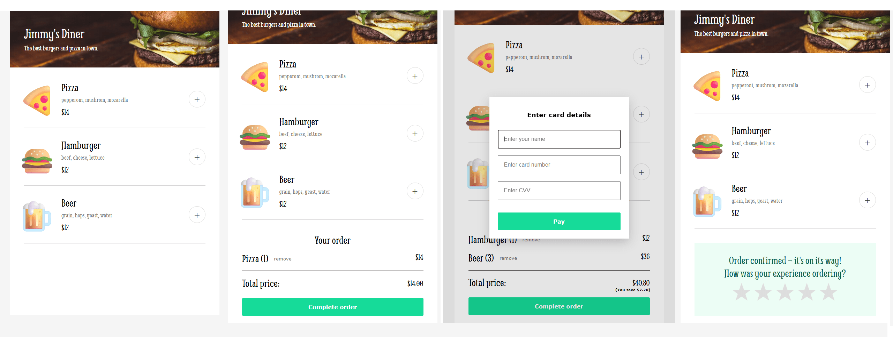

# Restaurant Ordering App

A simple food ordering app where users can browse menu items, add them to an order, and complete checkout through a payment modal.

## Screenshots

## Features

* Render menu items dynamically using JavaScript
* Add and remove items from order
* Live-updating order summary and total price
* Checkout modal with required form inputs
* Combo discount system applied automatically when conditions are met
* Star rating system for completed orders

## Credits

Design based on a Scrimba-provided Figma file.  

## Author

- GitHub - [amShuri](https://github.com/amShuri/)
- Scrimba - [amShuri](https://scrimba.com/@amShuri)
- Twitter - [@amShuri7](https://www.twitter.com/amshuri7)

